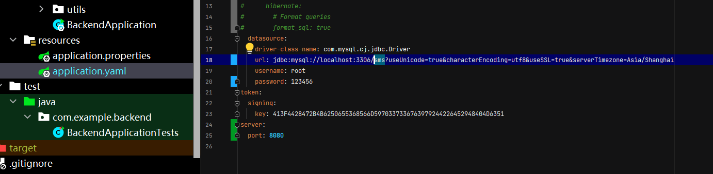
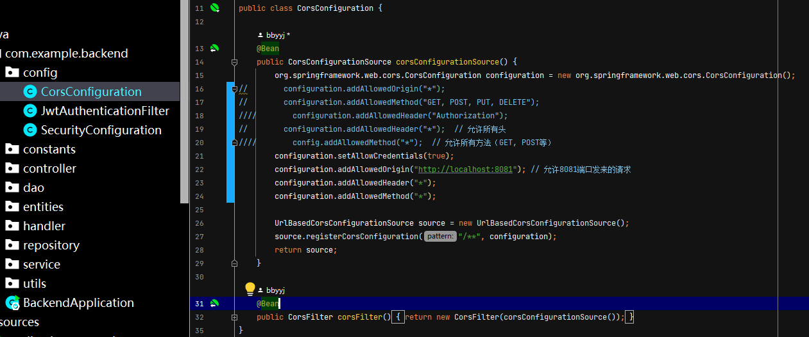

# StudentSystem
springboot+vue2

运行后端：
    1. 先进行构建 —— 提示下载JDK ——设置自动配置即可 ——直到BackendApplication左侧出现运行的绿色三角
    2. 创建数据库 —— 使用数据库表进行创建 
    3. 配置application.yaml 需要修改数据库对应的数据库名称（图中的sms）为你的数据库名称，修改到你自己的用户名和密码
    
    4. 配置CROS跨域设置 按照图中即可 端口号改为前端运行的端口号 解决跨域的问题
    
    5. 运行BackendApplication即可  